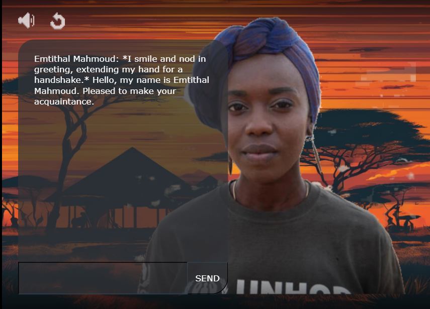

# Emtithal Mahmoud - Poet, Activist, Founder | UNHCR Goodwill Ambassador

## Overview

Emtithal Mahmoud - Poet. Activist, Founder is an educational and engaging game designed to provide players with an immersive experience of Emtithal's life, focusing on her journey as a refugee and her rise to ambassador status. The game aims to foster empathy and understanding of refugee experiences through storytelling and AI chatbot.

## Internship Project

This game is developed as part of an internship project, with the main goal of creating an impactful and informative game using Rosebud AI and the Phaser game framework. The project combines technical skill development with creative storytelling to produce a meaningful educational tool.

## Features

Educational Content: Learn about the life of Emtithal Mahmoud and the challenges faced by refugees.
Interactive Chat Scene: Ask Emtithal about her work and life using the AI chat bot.

## Technology Stack
Rosebud AI: Utilized for generating assets and enhancing the creative process.
Phaser: A powerful framework for developing 2D games, used to build and run the game.
Image editing software.

## Deployed link:

https://vickysug.github.io/emtithal-mahmoud/  (Note: The code used for the chat is specific to the Rosebud platform and therefore will not run in the deployed GitHub link.)

## Live on RosebudAi:

https://play.rosebud.ai/games/cb3c834b-2d5a-4e8b-82f7-fcd131ef6cd3

## Application Screenshot Application Screenshot

## License
This project is licensed under the MIT License. See the LICENSE file for more details.

## Acknowledgements
Special thanks to the Rosebud AI team for their support and resources.

Also thanks to Pixabay for the free music clip. https://pixabay.com/music/
